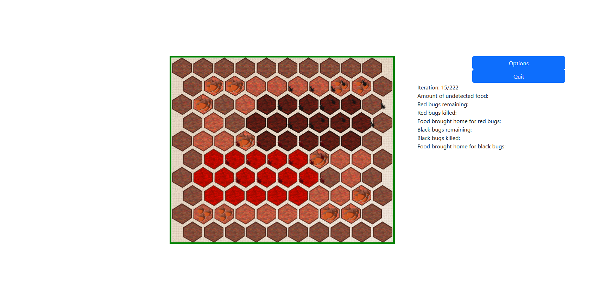
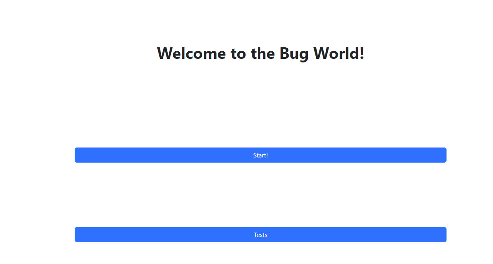
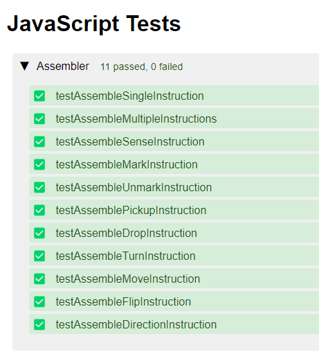

# README
This is an implementation of the game using HTML, CSS, and Javascript. This project's purpose is to implement an assembler to parse bug instructions, a GUI for the simulator, and the actual simulator itself ability to upload them and pasrse through client side.
# Sprint 3 Progress ( Latest )

# Link
[http://clabsql.clamv.jacobs-university.de/~lliadov](http://clabsql.clamv.jacobs-university.de/~lliadov)

# Summary
To make a long story short, before that moment everything was absolutely in a very sad state - the bug field was not square, although obviously it should be hexagonal. The bugs moved on their own and did not correspond to the squares in any way. The assembly code was mostly invalid. I don't know how the previous sprinters got more than zero points for this creation, but so be it. The visuals were completely fixed - the resolution of the pictures just didn't allow them to be displayed properly. The field sprites have been fixed, brought into hexagonal form. The logic of the bugs and ensuring that they move according to the field cells has been changed. Assembly code handling and implementation of several commands was added, for example. The position of the field on the screen has been changed slightly, making it more pleasing to the viewer.

## A. Organization
1. Organized HTML and javaScript files(removed unnecessary spacings and bad nesting).
2. Added more comments to code that didn't make sense.
3. Properly documented code that was changed or newly added.

## B. Map Changes and Assembler Changes
1. Map tiles are now hexagonal shape and more accurate to the specification.
2. Fixed Assembler such that it actually works and reads a bug brain assembly file.
	- Changed file processing and how it outputs to the code
3. Assembler interpretation for move commands (in previous sprint the assembler did not work at all).
4. Overhaul to bug display implementation
	- Bugs are displayed on the map relevant to each tile.
	- Bugs follow move commands given by assembler file.
	- Bugs moves every iteration instead of constantly.
5. Food is now displayed accordingly to the number given on the world file(amount of food changes visually).

## C. GUI Additions
1. CSS changes(Centering Upload menu, added the options buttons and stats display on the simulation page).
2. Stats Menu placeholder(Added under the code injection in fileLogic.js).
	- Working Iterations counter(doesn't do much but it counts till it's done).
	- Options menu button placeholder(brings you back to upload currently).

## D. Testing
1. Added new test files to /testcases that works better with the current build.
	- Map works only if all correct files are provided.
	- Bug assembler breaks if given anything thats not "move" instruction.
2. Most changes can be visually seen.
3. old test files moved to /legacy.

If all files are provided accordingly you should get something like this:

## E. Future Improvement
1. Option menu(likely on sim.html but maybe not using code injection with .write()).
2. Maybe not use .write() to put the html code for the simulation since it is harder to work with.
3. Fully working stats menu, log function not integrated yet.
4. Other Instructions for bug assembler implemented and working for the bug.
5. Better documentation since the original code we got was very messy, we didn't know how things worked together and what each piece of code did.
# Sprint 1 Progess

1. Created welcome page  
2. Created simulator page  
3. quit button on simulator page takes you back to welcome page  
4. Partially implemented `World` class  
5. Implemented `Cell` class  
6. Partially implemented `Bug` class  
7. Partially implemented `GUI` class  
8. Implemented ability to upload files and parse them all on the client-side  
9. Mostly implemented parsing of world map file which displays output of client side 
10. Created settings page, homepage, change settings page, and quit game page  
11. Documentation Comments for each function file class that was implemented  
12. Added test cases for errors and succesful  
13. Made a pdf file to explain all the progess  
14. There is also a display of bugs which move around only for display purposes yet to work on bug assembler code 

# Sprint 2 Progress

# Link
[http://clabsql.clamv.jacobs-university.de/~lleontev/](http://clabsql.clamv.jacobs-university.de/~lleontev/)

## A. Feature tests
1. Implemented Assembler in [Assembler.js](public_html/javascriptFiles/Assembler.js).
2. Implemented class World in [World.js](public_html/javascriptFiles/classes/World.js).

## B. Unit testing
1. Implemented [Assembler.test.js](public_html/javascriptFiles/test/Assembler.test.js).
2. Implemented [World.test.js](public_html/javascriptFiles/test/World.test.js).
3. Implemented [Cell.test.js](public_html/javascriptFiles/test/Cell.test.js).
4. Implemented [Bug.test.js](public_html/javascriptFiles/test/Bug.test.js).
## C. GUI
Implemented UI for tests.

## D. Documentation
The new code is documented with comments.

## E. Visual
Fixed the poor formatting of the previous team in [93e414a3](https://github.com/CU-Software-Engineering-2023/pair34_sprint2/commit/93e414a3d98943837cc80f561fa434c535c5024f)

